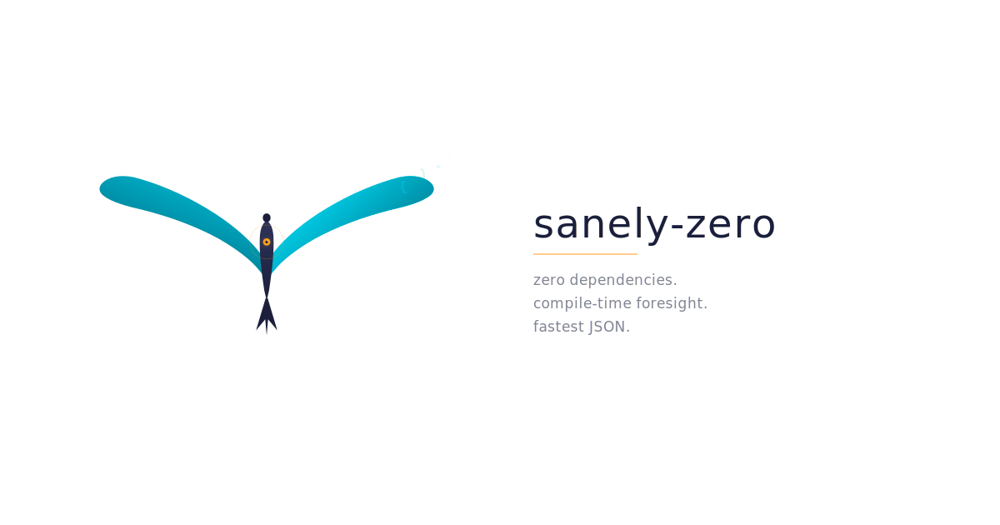

  <picture>
    <source media="(prefers-color-scheme: dark)" srcset="mascot/dark/rei-banner.svg">
    <source media="(prefers-color-scheme: light)" srcset="mascot/light/rei-banner.svg">
    
  </picture>

# sanely-zero

Zero-dependency JSON engine for Scala 3. Owns both the macro and the parser.

**Scala 3.8.2+ | JVM + Scala.js | Zero dependencies**

## The thesis

A JSON library that:

1. **Competes with or beats jsoniter-scala** on throughput and allocation
2. **Maintains 100% circe wire compatibility** — the contract is non-negotiable
3. **Has zero transitive dependencies** — just Scala stdlib
4. **Runs on JVM and Scala.js** from the same source

The core bet: **compile-time schema knowledge gives a structural advantage over any runtime-generic parser**. We know every field, every type, every variant at macro expansion time. A general-purpose parser handles arbitrary JSON. We don't have to.

## Why this can work

sanely-jsoniter already **surpasses** jsoniter-scala native — +3% reads, +25% writes — while using jsoniter-scala's own reader/writer underneath. The performance advantage comes entirely from the codec layer. If we also own the parser, we can push further.

| Technique | Source | Status |
|---|---|---|
| Direct constructor calls (+19% reads) | sanely-jsoniter | Proven |
| Branchless product encoding (+25% writes) | sanely-jsoniter | Proven |
| Speculative sequential field access | zio-blocks | Planned |
| Golden mask bitmask validation | kotlinx.serialization | Planned |
| Compile-time key byte arrays | DSL-JSON | Planned |
| Field-order prediction | Original | Planned |

## Status

Early research phase. See:

- [ANALYSIS.md](ANALYSIS.md) — competitive analysis vs jsoniter-scala, 4-phase implementation plan
- [RESEARCH.md](RESEARCH.md) — performance techniques from 12 JSON libraries across the ecosystem
- [MASCOT.md](MASCOT.md) — project mascot: Rei (零), the Zero Swift
